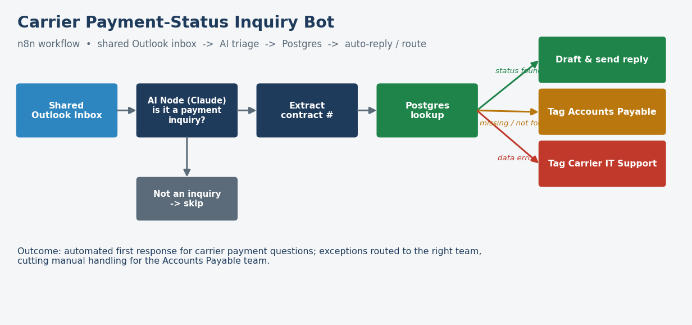
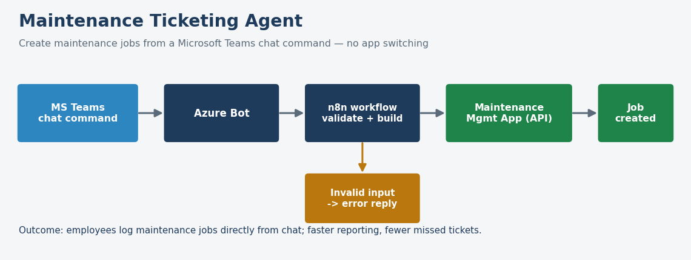

# AI Workflow Automation

Two production automations I built at **Charger Logistics** using **n8n**, an
**AI (Claude) node**, and Microsoft/Azure integrations — bundled here with
runnable Python reference implementations so the core logic can be reviewed end
to end.

> **Real-world impact:** These workflows removed repetitive manual work for the
> Accounts Payable and maintenance teams — automating carrier payment responses
> that previously had to be answered by hand, and letting staff log maintenance
> jobs straight from a chat message instead of switching into a separate app.

Everything here runs on **synthetic data** — no real emails, contracts, or
company systems are included. Production ran in n8n; the Python here reproduces
the decision logic so it's transparent and testable.

---

## 1. Carrier Payment-Status Inquiry Bot



Carriers constantly email a shared inbox asking "when will we be paid for
contract X?" This workflow answers them automatically.

**How it works**

1. Watches a shared Outlook inbox for new mail.
2. An **AI node** reads each email and decides whether it's a payment-status inquiry.
3. If it is, it extracts the **contract number** from the body.
4. It looks the contract up in **Postgres** and then:
   - **drafts and sends a reply** with the payment status, or
   - **tags Accounts Payable** if the contract number is missing or not found, or
   - **tags Carrier IT Support** if the contract record has a data error.

**Run the reference implementation**

```bash
cd payment_inquiry_bot
python triage.py
```

It processes the sample inbox and prints each routing decision, then writes the
drafted replies and a `routing_log.csv` to `payment_inquiry_bot/output/`:

```
[01] Payment status for CON-100234    -> REPLY  | Paid
[04] Payment inquiry CON-100260       -> ROUTE  | Carrier IT Support
[06] Payment status of CON-999999     -> ROUTE  | Accounts Payable
[09] This week in logistics...        -> SKIP   | Not a payment-status inquiry
```

Files: [`triage.py`](payment_inquiry_bot/triage.py) ·
[`contracts.csv`](payment_inquiry_bot/contracts.csv) (mock DB) ·
[`sample_emails.json`](payment_inquiry_bot/sample_emails.json)

---

## 2. Maintenance Ticketing Agent



Lets employees create maintenance jobs directly from **Microsoft Teams**, without
opening the maintenance-management application.

**How it works**

1. An employee types a command in Teams, e.g.
   `/maintenance create unit=TRK-4482 priority=high issue="brake light out"`.
2. An **Azure Bot** passes it to an **n8n** workflow.
3. n8n validates the request, builds the job payload, and creates the job in the
   maintenance app via its API — or replies with a clear error if the input is invalid.

**Run the reference implementation**

```bash
cd ticketing_agent
python create_ticket.py
```

It parses a set of sample commands (including invalid ones) and shows the Teams
reply plus the JSON payload that would be sent to the maintenance app:

```
> /maintenance create unit=TRK-4482 priority=high issue="brake light out"
  ✅ Maintenance job MJ-4401 created for TRK-4482 (high priority): "brake light out".

> /maintenance create unit=BADUNIT issue="won't start"
  ⚠️ Could not create job: Invalid or missing unit id: 'BADUNIT'
```

File: [`create_ticket.py`](ticketing_agent/create_ticket.py)

---

## Tech

**In production:** n8n, Claude (AI node), Outlook / Microsoft 365, Azure Bot,
Microsoft Teams, PostgreSQL, REST APIs
**In this repo:** Python (standard library only)

## Run everything

```bash
python payment_inquiry_bot/triage.py
python ticketing_agent/create_ticket.py
```

No third-party packages required (Python 3.9+).
